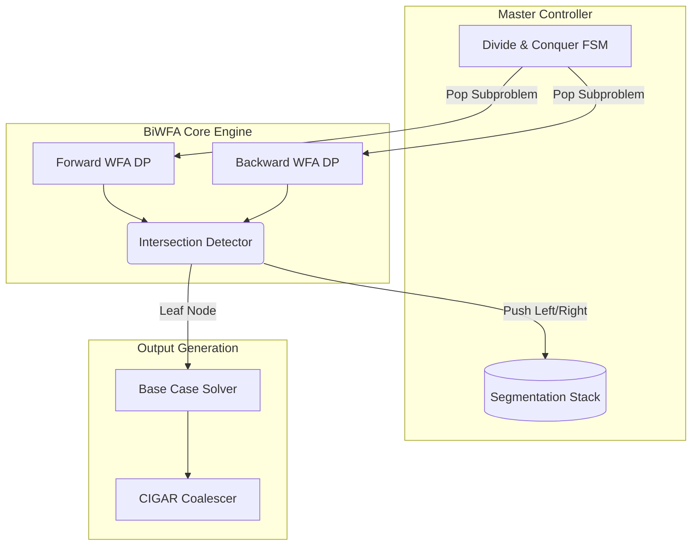

# Full Bi-Directional Wavefront Alignment (BiWFA) Hardware Architecture

This document defines the complete, mathematically rigorous hardware architecture for a Bi-Directional Wavefront Alignment (BiWFA) FPGA accelerator. The architecture uses a structural divide-and-conquer approach to keep memory complexity bounded at **O(s_max)**, avoiding the traditional O(N²) storage overhead of traceback matrices.

## 1. High-Level Architecture Block Diagram

The BiWFA hardware is decomposed into the following core subsystems:
- **BiWFA Controller (Master FSM):** Manages recursive calls, coordinates forward/backward engines, and runs the sequence partitioning logic.
- **BiWFA Core Engine:** Runs the dual Forward and Backward WFA algorithms up to the intersection point.
- **Intersection Detector:** Evaluates overlap conditions at every score iteration `s`.
- **Segmentation Stack:** LIFO memory structure holding unresolved subproblems `(q_start, q_end, r_start, r_end)`.
- **Base Case Solver:** Resolves small sequences or perfect matches (`s=0`) structurally and emits CIGAR strings.
- **CIGAR Encoder (Coalescer):** Merges contiguous identical operations into final compressed strings (e.g., 3M, 1D, 2I).



---

## 2. Hardware Module Breakdown & FSM Descriptions

### A. Segmentation Stack Controller (`biwfa_seg_stack`)
To enable the recursive divide-and-conquer algorithm, the hardware utilizes a LIFO stack.
- **Memory Structure:** BRAM or distributed LUTRAM.
- **Data Packet:** `[q_start, q_end, r_start, r_end]` (Width = `4 * ADDR_WIDTH`).
- **Depth:** Bound linearly by `O(s_max)` since recursion divides the maximum edit distance into two halves per tier. Depth of `log2(MAX_SEQ_LEN)` or `s_max` is sufficient.
- **Behavior:** The Master FSM pops a segment, runs the dual alignment. Upon intersection at `(q*, r*)`, it pushes the right segment `(q*, q_end, r*, r_end)` and then the left segment `(q_start, q*, r_start, r*)`.

### B. Dual WFA Execution Engine (`biwfa_engine`)
Instantiates two symmetric but independent data paths for the WFA match-extend recurrence.
1. **Forward Kernel (`wfa_fwd_kernel`)**
   - Recurrence: `O_fwd(s,k) = MAX( O_fwd(s-1, k-1)[Ins], O_fwd(s-1, k)[Mis]+1, O_fwd(s-1, k+1)[Del]+1 )`
   - Initialized at `(q_start, r_start)`. Sequences feed strictly forward.
2. **Backward Kernel (`wfa_bwd_kernel`)**
   - Recurrence identical to forward, but stepping from `(q_end, r_end)` backwards toward `(q_start, r_start)`.
   - The memory for sequences must allow reversed coordinate traversal `(q_end - x, r_end - y)`.

*Crucial Hardware Detail:* These kernels must be synchronized. The system advances `s=0`, sweeps all `k` in both implementations, saves offsets, then checks intersection before advancing to `s+1`.

### C. Intersection Detector (`biwfa_intersect`)
Monitors the global coordinates of both forward and backward offsets to determine collision.
- **Diagonal Mapping:** For a given sub-segment length `N = q_end - q_start` and `M = r_end - r_start`, the backward diagonal `k_bwd` maps to the forward diagonal `k_fwd` via: 
  `k_bwd = (N - M) - k_fwd`
- **Overlap Condition:** The hardware checks valid arrays for every calculated diagonal at the end of the `s` loop step:
  `If (O_fwd(s, k_fwd) + O_bwd(s, k_bwd) >= N)` -> *Intersection Found!*
- Upon finding the highest legal `x` collision on any valid diagonal, it latches the intersection tuple `(s*, k_fwd*, x_fwd*)`. This maps to global string indices `q* = q_start + x_fwd*` and `r* = r_start + (x_fwd* - k_fwd*)`.

### D. Divide-and-Conquer Master FSM (`biwfa_master_ctrl`)
Validates and branches based on sub-problem size. State Machine flow:

1. **`POP_STACK`**: Pull the next sequence boundaries from the stack. If stack empty, `FINISH_ALIGNMENT`.
2. **`CHECK_BASE_CASE`**: Calculate `len_q = q_end - q_start` and `len_r = r_end - r_start`. If these lengths are smaller than a programmable threshold (e.g., `<= 4`), transition to `RUN_BASE_SOLVER`. Else, `RUN_BIWFA`.
3. **`RUN_BIWFA`**: Wait for `biwfa_engine` to flag `intersection_found` or `alignment_complete`.
4. **`SPLIT_PUSH`**: Using the returned `(q*, r*)`:
   - If `s* == 0`, a perfect match occurred over the whole segment. Transition directly to `EMIT_MATCHES`.
   - Otherwise, push `[q*, q_end, r*, r_end]` (Right Sub-problem).
   - Then push `[q_start, q*, r_start, r*]` (Left Sub-problem).
   - Return to `POP_STACK`.

### E. Base Case Solver & CIGAR Encoder (`biwfa_base_solver`)
When sequence limits fall below the divide threshold or `s=0`:
- Performs standard match/mismatch extension on the remaining characters.
- Generates operation streams:
  - Constant `k` + Advancing `x` = Match (M) or Mismatch (X)
  - Increasing `k` = Insertion (I)
  - Decreasing `k` = Deletion (D)
- The **CIGAR Coalescer** buffers identical consecutive operations. Example: if it receives `M, M, M, D, I, I`, it delays serialization and outputs `3M`, `1D`, `2I` when the `op_code` shifts.

---

## 3. Memory Organization & Complexity

Traditional Traceback matrices require `O(N*M)` storage. This architecture maintains strict **O(s)** memory bounds:

1. **Wavefront State Memory (Layer 3 Storage)**
   - Forward Engine: `O_fwd_curr[k]`, `O_fwd_next[k]`
   - Backward Engine: `O_bwd_curr[k]`, `O_bwd_next[k]`
   - RAM Size = `4 * 2 * K_MAX` elements. For `K_MAX = 1024` and 16-bit offset width, total BRAM < 32 KB.

2. **Segmentation Stack Memory**
   - Stores up to `s_max` entries of 4 elements (16 bits each).
   - Worst case stack depth `1024` -> `1024 * 64 bits = 8 KB`.

**Total Working Memory:** < 40 KB, completely invariant to Sequence Length `N` and `M`, which can scale to 10M+ bases as long as memory addressing logic fits.

---

## 4. Parameterization & Synthesis Rigor

The hardware is designed for highly constrained performance scaling:
- **`SCORE_WIDTH`**: Dynamic range for edit distance operations.
- **`MAX_SEQ_LEN`**: Controls address pointer sizes (`ADDR_WIDTH = log2(MAX_SEQ_LEN)`).
- **`K_MIN` / `K_MAX`**: Restricts memory array size for specific bounded biological error assumptions.
- **Guard Rails (Safeguards)**:
   - Sequence address tracking incorporates mathematically precise `out_of_bounds` gating. Address generators include hard limits: `x_fwd <= q_end`, `y_fwd <= r_end`.
   - `NULL_OFFSET` (All 1's padding) ensures that wavefront calculations near bounds accurately drop dead diagonals (`k`) out of the evaluation window.

## 5. Summary of Mathematical Transitions
For hardware correctness, transitions MUST be evaluated concurrently without priority starvation. 
```verilog
wire [OFFSET_WIDTH-1:0] ins_op = O_fwd[s-1][k-1];
wire [OFFSET_WIDTH-1:0] mis_op = O_fwd[s-1][k+0] + 1;
wire [OFFSET_WIDTH-1:0] del_op = O_fwd[s-1][k+1] + 1;

// The maximal valid coordinate on diagonal k is the extension starting point
wire [OFFSET_WIDTH-1:0] x_base = max(ins_op, mis_op, del_op);
```
Once `x_base` is latched, the `biwfa_engine` streams characters until `Q[x_base + ext] != R[x_base - k + ext]`, resolving the final `O_fwd(s,k)`.
